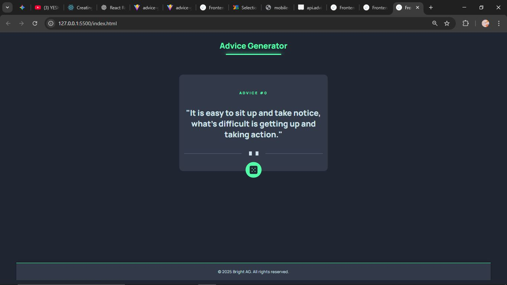

# Frontend Mentor - Advice Generator App Solution

This is my solution to the [Advice Generator App challenge](https://www.frontendmentor.io/challenges/advice-generator-app-QdUG-13db) on Frontend Mentor.  
Frontend Mentor challenges help you improve your coding skills by building realistic projects.

---

## Table of contents

- [Overview](#overview)
  - [The challenge](#the-challenge)
  - [Screenshot](#screenshot)
  - [Links](#links)
- [My process](#my-process)
  - [Built with](#built-with)
  - [What I learned](#what-i-learned)
  - [Continued development](#continued-development)
  - [Useful resources](#useful-resources)
- [Author](#author)

---

## Overview

### The challenge

Users should be able to:

- View the optimal layout for the app depending on their device's screen size  
- See hover and active states for the dice button  
- Generate a new piece of advice by clicking the dice icon (fetched from an API)

---

### Screenshot



---

### Links

- **Solution URL:** https://github.com/innerweb404-web/Advice-Generator-App.git
- **Live Site URL:**https://innerweb404-web.github.io/Advice-Generator-App/

---

## My process

### Built with

- Semantic **HTML5** markup  
- **CSS3** (Flexbox, transitions, glow animation effects)  
- **Vanilla JavaScript (ES6)** — for fetching advice from the [Advice Slip API](https://api.adviceslip.com/advice)  
- **Mobile-first workflow**

---

### What I learned

This project helped me understand how to:

- Fetch and display data from a public API using `fetch()`  
- Position elements with `absolute` and `transform` to align icons perfectly  

Here’s a snippet from my JavaScript:

```js
const adviceNum = document.querySelector(".num");
const adviceText = document.querySelector(".advice");
const dice = document.querySelector(".icon-dice");

async function getAdvice() {
  const res = await fetch("https://api.adviceslip.com/advice");
  const data = await res.json();
  adviceNum.textContent = data.slip.id;
  adviceText.textContent = `"${data.slip.advice}"`;
}

dice.addEventListener("click", getAdvice);
```

### Continued development
In future projects, I’d like to:
- Practice using async/await for multiple API requests.
- Explore how to store previous advice in local storage.
- Add smooth fade-in animations when new advice appears.

### Useful resources
- [MDN Web Docs – Fetch API](https://developer.mozilla.org/en-US/docs/Web/API/Fetch_API)
- [Frontend Mentor Challenge Page](https://www.frontendmentor.io/challenges/advice-generator-app-QdUG-13db)

### Author

- Frontend Mentor – [@yourusername](https://www.frontendmentor.io/profile/@innerweb404-web)
- Twitter – [@yourusername](https://www.twitter.com/@bightWeb_3)
